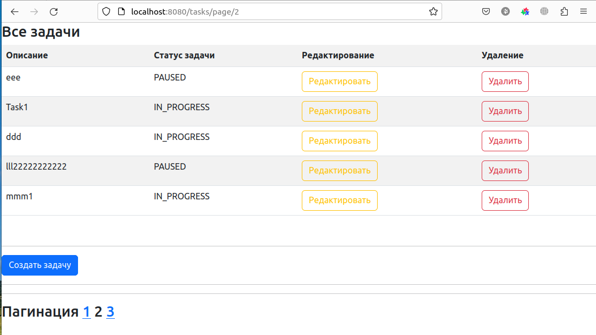

## CRUD приложение на Spring MVC todo_list

Для работы необходимо создать бд todo

CREATE DATABASE  todo

создать таблицу

CREATE TABLE task
(
id          bigint generated by default as identity primary key,
description varchar(100) NOT NULL,
status      int NOT NULL
);

Стек технологий: PostgreSql, Hibernate, Spring, Spring MVC, Thymeleaf, Bootstrap 5

Интерфейс выглядет так

